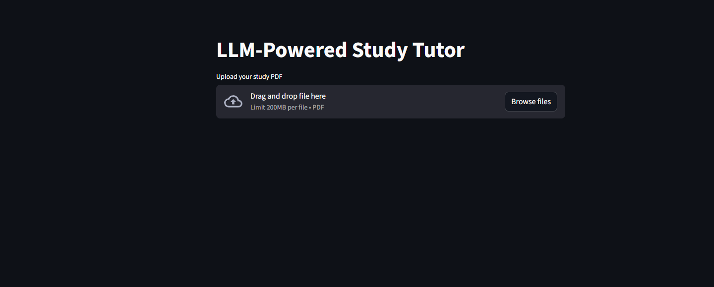
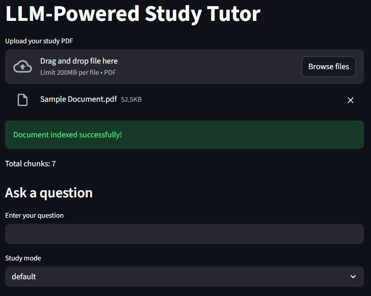

# LLM-Powered Study Tutor (Offline, RAG-Based)

An offline-first AI study assistant that answers questions, generates summaries,
and creates quizzes from user-uploaded PDFs using Retrieval-Augmented Generation (RAG).

## Features
- Upload PDF study notes or textbooks
- Semantic search using FAISS
- Offline LLM inference using Ollama (Mistral 7B)
- Study modes:
  - Question Answering
  - Summaries
  - Explain Like I'm 12 (ELI12)
  - Quiz Generation
- Transparent source chunk display
- Runs fully locally (no paid APIs)


## System Architecture

1. PDF text is extracted and split into overlapping chunks
2. Each chunk is converted into an embedding using Sentence Transformers
3. Embeddings are stored in a FAISS vector database
4. User questions are embedded and used to retrieve relevant chunks
5. Retrieved chunks are injected into a prompt
6. A local LLM (Mistral 7B via Ollama) generates grounded responses
```pgsql
User uploads PDF
        ↓
PDF Text Extraction
        ↓
Text Chunking
        ↓
Embedding Generation
        ↓
FAISS Vector Store
        ↓
User Question
        ↓
Semantic Search (Top-k Chunks)
        ↓
Prompt Construction
        ↓
Local LLM (Ollama)
        ↓
      Answer
```
### Component Responsibilities
| Component     | Responsibility                            |
| ------------- | ----------------------------------------- |
| pdf_loader    | Extract text from PDFs                    |
| text_splitter | Split text into overlapping chunks        |
| embeddings    | Convert text to vector embeddings         |
| vector_store  | Store and retrieve vectors using FAISS    |
| rag           | Retrieve context and generate answers     |
| prompts       | Control LLM behavior via prompt templates |
| app.py        | Streamlit UI and orchestration            |


## Tech Stack
- Python
- Streamlit
- FAISS
- sentence-transformers
- Ollama (Mistral 7B)
- Requests


## How to Run

```bash
pip install -r requirements.txt
streamlit run app.py
```

 - Ensure Ollama is running and the Mistral model is pulled:
 
    ```bash 
    ollama pull mistral
    ```

## Ethical Design
 - No external API or data-sharing
 - Answers are grounded in user-provided documents
 - Model explicityly says "I don't know" if context is missing

## Learning Outcomes
 - Retrieval-AUgmented Generation (RAG)
 - Vector Databases
 - Prompt Engineering
 - Offline LLM Deployment
 - Stateful Application Design

## Future Enhancements
 - OCR support for scanned PDFs using Tesseract
 - Sentence-level source highlighting for answers
 - Page-numbered citations for improved traceability
 - Multi-PDF support with document-level metadata

## Limitations
 - The system works only with text-based PDFs; scanned or image-only PDFs are not supported without OCR. Images, diagrams, and charts inside PDFs are not interpreted by the model.
 - Answers are generated based only on the retrieved text chunks and may miss information outside the retrieved context.
 - The vector store is not presisted across app restarts; PDFs must be reprocessed each time.
 - Performance may degrade with very large PDFs due to local embedding and indexing.
 - The quality of answers depends on the capabilities of the the local LLM and the chosen chuunking strategy.

# Screenshots
## Home Page

## Uploading the ```Sample Document.pdf``` and Creating the Vector Store

## Asking Questions Using RAG
